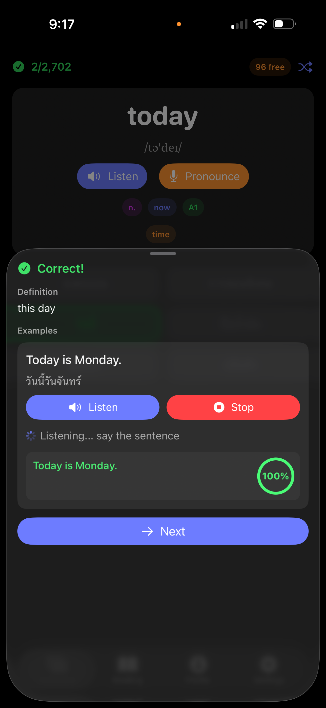
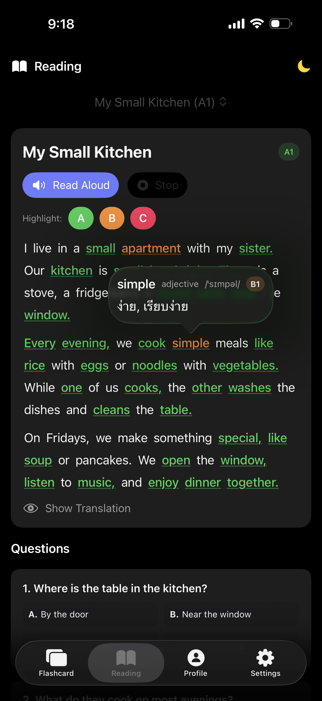
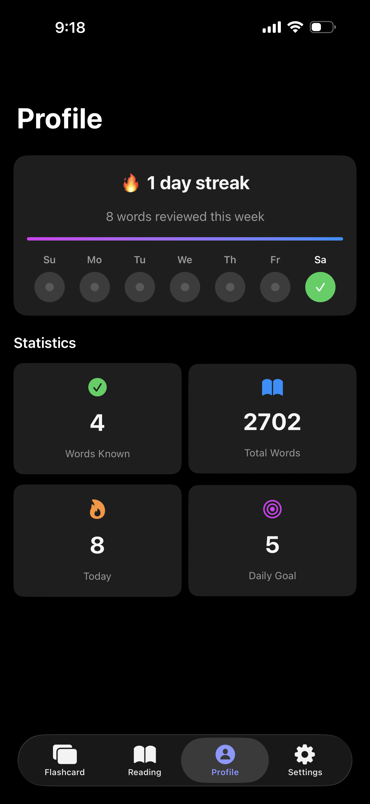

# FlashCards: CEFR English Vocabulary

English vocabulary learning app with flashcards, reading comprehension, and speaking practice.

[](https://apps.apple.com/th/app/flashcards-cefr-english/id6759033338)

**Website**: https://flashcard.coinbx.com/

## Features

- **10,674 words** from Oxford 5000, CEFR levels A1–C2
- **Translations** in Thai, Chinese, Spanish, French, Japanese, Korean
- **Neural TTS** (Piper) for natural English pronunciation — works offline
- **Speaking practice** with pronunciation scoring
- **Adaptive Speaking Test** — finds your CEFR level
- **Reading mode** — articles with vocabulary highlighting
- **Custom articles** — paste any English text, vocab auto-highlighted
- **Freemium** — 100 free attempts, one-time unlock

## Screenshots

<table>
  <tr>
    <td></td>
    <td></td>
    <td></td>
    <td></td>
  </tr>
</table>

## Vocabulary Data

This repo hosts the vocabulary and reading data used by the iOS app for auto-updates:

```
data/
├── version.json       # Current data version
├── vocabulary.json    # 10,674 words (Oxford 5000, CEFR A1–C2)
└── readings.json      # ~35 curated English articles
```

The app checks `data/version.json` on launch and downloads updates automatically.

### Word Schema

```json
{
  "id": 1,
  "word": "example",
  "pos": "noun",
  "level": "B1",
  "hint": "an instance used to illustrate",
  "ipa": "ɪɡˈzɑːmpəl",
  "cats": ["academic", "daily"],
  "synonyms": ["instance", "case"],
  "translations": {
    "th": "ตัวอย่าง",
    "zh": "例子",
    "es": "ejemplo",
    "fr": "exemple",
    "ja": "例",
    "ko": "예시"
  },
  "examples": [
    {
      "en": "This is an example sentence.",
      "translations": {
        "th": "นี่คือประโยคตัวอย่าง",
        "zh": "这是一个示例句子。"
      }
    }
  ]
}
```

## CEFR Levels

| Level | Description | Color |
|-------|-------------|-------|
| A1–A2 | Beginner / Elementary | Green |
| B1–B2 | Intermediate / Upper Intermediate | Orange |
| C1–C2 | Advanced / Proficiency | Pink |
